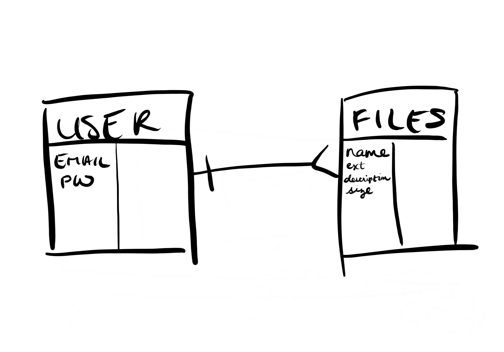

# Team 3 Uploader

## User Stories
As a user, I would like to be able to sign up for the application using an email, password, and password verification.
As a user, I would like to be able to sign in using an email and password.
As a signed-in user, I would like to be able to change my password using my old password and new password.
As a signed-in user, I would like to be able to change my password but not when signed out.
As a signed-in user, I would like to be able to sign out of the application.
As a signed-in user, I would like to be able to select an image file from my computer via GUI to select a file to upload, and store it on AWS.
As a signed-in user, I would like to be able to see ALL images from different users.
AS a signed-in user, I would like to be able to see the details (name, description, timestamps, & tag) of individual image.
As a signed-in user, I would like to be able to to update the details of _only_ my image.
As a signed-in user, I would like to be able to delete my _own_ image from the database and no one else's.

## ERD

